# 🚗 Student Commute Optimizer

## 1. Problem Understanding  
Many students commute individually to school or college, which leads to:  
- Increased travel costs  
- Traffic congestion  
- Higher environmental impact  

The goal is to design a **Student Commute Optimizer** – a carpooling and route-sharing platform that matches students traveling along similar routes, while keeping their identities **anonymous**.

---

## 2. Proposed Solution  
Our solution is a **full-stack system** with the following features:  
- **Student-facing frontend** where users enter their home and destination.  
- **Backend system** to compare routes and suggest nearby matches.  
- **Unique anonymous usernames** for each student.  
- **Chat feature** for direct communication between matched students.  

---

## 3. High-Level Architecture (Mermaid Diagram)

> The following diagram illustrates the complete user journey and data flow through our system:

```mermaid
graph TD
    %% User Entry Points
    StudentUser(👤 Student User)
    
    %% Authentication Flow
    LoginScreen[📱 Login Screen]
    AuthService[🔐 Authentication Service]
    AnonymizeUser[🎭 Anonymize User Data]
    SessionCreate[🎫 Create Session]
    
    %% User Input Flow
    PreferencesInput[📝 Input Preferences]
    LocationCapture[📍 Capture User Location]
    RouteInput[🛣️ Input Start/End Points]
    TimePreferences[⏰ Set Time Preferences]
    RidePreferences[🚗 Set Ride Preferences]
    
    %% Data Validation
    ValidateInput[✅ Validate Input Data]
    LocationValidation[🗺️ Validate Locations]
    ErrorHandler[❌ Handle Input Errors]
    
    %% Matching Process
    TriggerMatching[🎯 Trigger Matching Algorithm]
    GeoProcessor[🌍 Process Geographic Data]
    MapAPICall[🗺️ Call Maps API]
    RouteOptimization[🛤️ Route Optimization]
    DistanceCalculation[📏 Calculate Distances]
    MatchingAlgorithm[🔍 Run Matching Algorithm]
    MLOptimization[🤖 ML-Based Optimization]
    
    %% Results Processing
    GenerateMatches[📋 Generate Match Results]
    RankMatches[🏆 Rank Matches by Score]
    FilterResults[🔽 Filter & Limit Results]
    CacheResults[💾 Cache Results]
    
    %% Display Results
    DisplayMatches[📱 Display Match Results]
    MatchDetails[📄 Show Match Details]
    UserDecision{🤔 User Selects Match?}
    
    %% Communication Flow
    InitiateChat[💬 Initiate Chat]
    ChatService[💭 Chat Service Handler]
    RealTimeMessaging[⚡ Real-time Messaging]
    MessageStorage[💾 Store Messages]
    
    %% Notification Flow
    NotificationTrigger[🔔 Trigger Notifications]
    NotificationService[📢 Notification Service]
    PushNotification[📱 Send Push Notification]
    SMSNotification[📧 Send SMS/Email]
    NotificationLog[📝 Log Notifications]
    
    %% Background Processes
    ScheduledJobs[⏰ Scheduled Jobs]
    BatchMatching[📊 Batch Match Processing]
    DataCleanup[🧹 Data Cleanup]
    AnalyticsUpdate[📈 Update Analytics]
    
    %% Storage Operations
    UserDataStore[💾 Store User Data]
    MatchDataStore[💾 Store Match Data]
    ChatDataStore[💾 Store Chat Data]
    SessionStore[💾 Store Session Data]
    
    %% Error Handling & Monitoring
    ErrorLogging[📋 Error Logging]
    SystemMonitoring[📊 System Monitoring]
    PerformanceTracking[📈 Performance Tracking]
    
    %% Main Process Flow
    StudentUser --> LoginScreen
    LoginScreen --> AuthService
    AuthService --> AnonymizeUser
    AnonymizeUser --> SessionCreate
    SessionCreate --> UserDataStore
    SessionCreate --> PreferencesInput
    
    PreferencesInput --> LocationCapture
    PreferencesInput --> RouteInput
    PreferencesInput --> TimePreferences
    PreferencesInput --> RidePreferences
    
    LocationCapture --> ValidateInput
    RouteInput --> ValidateInput
    TimePreferences --> ValidateInput
    RidePreferences --> ValidateInput
    
    ValidateInput --> LocationValidation
    ValidateInput --> TriggerMatching
    ValidateInput --> ErrorHandler
    LocationValidation --> MapAPICall
    ErrorHandler --> PreferencesInput
    
    TriggerMatching --> GeoProcessor
    GeoProcessor --> MapAPICall
    MapAPICall --> RouteOptimization
    RouteOptimization --> DistanceCalculation
    DistanceCalculation --> MatchingAlgorithm
    MatchingAlgorithm --> MLOptimization
    MLOptimization --> GenerateMatches
    
    GenerateMatches --> RankMatches
    RankMatches --> FilterResults
    FilterResults --> CacheResults
    CacheResults --> MatchDataStore
    CacheResults --> DisplayMatches
    
    DisplayMatches --> MatchDetails
    MatchDetails --> UserDecision
    UserDecision -->|Yes| InitiateChat
    UserDecision -->|No| DisplayMatches
    
    InitiateChat --> ChatService
    ChatService --> RealTimeMessaging
    RealTimeMessaging --> MessageStorage
    MessageStorage --> ChatDataStore
    
    InitiateChat --> NotificationTrigger
    NotificationTrigger --> NotificationService
    NotificationService --> PushNotification
    NotificationService --> SMSNotification
    NotificationService --> NotificationLog
    
    %% Background Processes
    ScheduledJobs --> BatchMatching
    ScheduledJobs --> DataCleanup
    ScheduledJobs --> AnalyticsUpdate
    BatchMatching --> MatchingAlgorithm
    
    %% Monitoring & Logging
    AuthService --> ErrorLogging
    MatchingAlgorithm --> ErrorLogging
    ChatService --> ErrorLogging
    NotificationService --> ErrorLogging
    
    ValidateInput --> SystemMonitoring
    MatchingAlgorithm --> SystemMonitoring
    ChatService --> SystemMonitoring
    
    GeoProcessor --> PerformanceTracking
    MatchingAlgorithm --> PerformanceTracking
    RealTimeMessaging --> PerformanceTracking
    
    %% Styling
    classDef userflow fill:#e3f2fd,stroke:#1976d2,stroke-width:2px,color:#0d47a1
    classDef authentication fill:#f3e5f5,stroke:#7b1fa2,stroke-width:2px,color:#4a148c
    classDef processing fill:#fff3e0,stroke:#f57c00,stroke-width:2px,color:#e65100
    classDef matching fill:#e8f5e8,stroke:#388e3c,stroke-width:2px,color:#1b5e20
    classDef communication fill:#fce4ec,stroke:#c2185b,stroke-width:2px,color:#880e4f
    classDef storage fill:#f1f8e9,stroke:#689f38,stroke-width:2px,color:#33691e
    classDef monitoring fill:#fff8e1,stroke:#ffa000,stroke-width:2px,color:#ff6f00
    classDef background fill:#f5f5f5,stroke:#616161,stroke-width:2px,color:#424242
    
    class StudentUser,LoginScreen,PreferencesInput,LocationCapture,RouteInput,TimePreferences,RidePreferences,DisplayMatches,MatchDetails userflow
    class AuthService,AnonymizeUser,SessionCreate authentication
    class ValidateInput,LocationValidation,ErrorHandler,TriggerMatching processing
    class GeoProcessor,MapAPICall,RouteOptimization,DistanceCalculation,MatchingAlgorithm,MLOptimization,GenerateMatches,RankMatches,FilterResults,CacheResults matching
    class InitiateChat,ChatService,RealTimeMessaging,MessageStorage,NotificationTrigger,NotificationService,PushNotification,SMSNotification,NotificationLog communication
    class UserDataStore,MatchDataStore,ChatDataStore,SessionStore storage
    class ErrorLogging,SystemMonitoring,PerformanceTracking monitoring
    class ScheduledJobs,BatchMatching,DataCleanup,AnalyticsUpdate background
```



### 🔄 Process Flow Overview

The system follows a comprehensive flow from user authentication to real-time communication:

#### 1. **🔐 Authentication Layer**
- Secure user login with anonymization
- Session management and user data protection

#### 2. **📝 Input Processing** 
- Location capture and validation
- Route preferences and time settings
- Comprehensive input validation

#### 3. **🎯 Matching Algorithm**
- Geographic data processing
- Route optimization using Maps APIs
- ML-powered matching with distance calculations

#### 4. **📱 Results & Communication**
- Ranked match results with caching
- Real-time chat functionality  
- Push notifications and SMS alerts

#### 5. **📊 Background Operations**
- Scheduled batch processing
- System monitoring and analytics
- Data cleanup and performance tracking

### 🎨 Color Legend

| Color | Process Type |
|-------|-------------|
| 🔵 **Blue** | User Interaction Flow |
| 🟣 **Purple** | Authentication & Security |
| 🟠 **Orange** | Data Processing & Validation |
| 🟢 **Green** | Matching Algorithm & Results |
| 🔴 **Pink** | Communication & Notifications |
| 🟡 **Yellow** | Monitoring & Logging |
| ⚫ **Gray** | Background Processes |

### 🚀 Key Features

- **Real-time Matching**: Advanced geospatial algorithms for optimal route matching
- **Secure Communication**: End-to-end encrypted chat with anonymized user data
- **Smart Notifications**: Multi-channel notification system (Push, SMS, Email)
- **Performance Monitoring**: Comprehensive logging and performance tracking
- **Scalable Architecture**: Microservices-based design for high availability

---

## 4. Pseudo Code

### 🎯 Student Matching by Route

Our core matching algorithm efficiently finds compatible students based on proximity, route overlap, and time windows:

```javascript
function findMatches(newStudent, allStudents):
    matches = []
    for student in allStudents:
        if distance(newStudent.home, student.home) < HOME_THRESHOLD:
            if distanceAlongRoute(newStudent.route, student.route) < ROUTE_THRESHOLD:
                if timeWindowOverlap(newStudent.time, student.time):
                    matches.append(student)
    sortMatchesBy(scoreDistance + scoreTime + scoreRouteOverlap)
    return topK(matches)
```

**Algorithm Features:**
- 📍 **Proximity Filtering**: Checks home location distance threshold
- 🛣️ **Route Optimization**: Calculates route overlap and compatibility  
- ⏰ **Time Matching**: Ensures overlapping time windows
- 🏆 **Smart Scoring**: Multi-factor scoring system for optimal matches

### 🎭 Generate Unique Anonymous Username

Privacy-first approach with unique, anonymous user identification:

```javascript
function generateUsername():
    timestamp = currentUnixTimestamp()
    randomSuffix = randomInt(1000,9999)
    return "student_" + timestamp + "_" + randomSuffix
```

**Privacy Benefits:**
- 🔒 **Anonymous Identity**: No personal information exposed
- 🎲 **Unique Generation**: Timestamp + random ensures uniqueness
- 🛡️ **Safety First**: Protects student privacy during matching

### 💬 Chat Simulation (Simplified)

Real-time communication system for matched students:

```javascript
function startChat(userA, userB):
    sessionId = createChatSession(userA.id, userB.id)
    return sessionId

function sendMessage(sessionId, fromUser, message):
    messageObj = {sessionId, fromUser, message, timestamp}
    storeInDB("chats", messageObj)
    pushToReceiverIfConnected(sessionId, messageObj)  // WebSocket or polling
```

**Chat Features:**
- 🔗 **Session Management**: Secure chat session creation
- ⚡ **Real-time Delivery**: WebSocket-based instant messaging
- 💾 **Message Persistence**: Chat history stored in database

---

## 5. Tech Stack Choices

### Frontend Stack
- **Framework**: React.js (or HTML + JavaScript)
- **Mapping**: Leaflet.js for interactive map visualization
- **Styling**: CSS3 with responsive design
- **State Management**: React Context API or Redux

### Backend Stack  
- **Runtime**: Node.js + Express.js (Alternative: Python Flask/FastAPI)
- **API Design**: RESTful architecture with JSON responses
- **Authentication**: JWT tokens with session management
- **Middleware**: CORS, rate limiting, request validation

### Database Solutions
- **MVP**: In-memory store for rapid prototyping
- **Production**: MongoDB (document-based) or PostgreSQL (relational)
- **Caching**: Redis for session management and quick lookups
- **Message Queue**: RabbitMQ for notification processing

### External Services
- **Mapping APIs**: 
  - Google Maps API (comprehensive features)
  - Mapbox (customizable styling)  
  - OSRM (open-source routing)
- **Real-time Communication**: Socket.io (WebSockets + fallbacks)
- **Notifications**: Firebase Cloud Messaging (FCM)

### Deployment & Infrastructure
- **Containerization**: Docker for consistent environments
- **MVP Deployment**: Single instance with Docker Compose
- **Production Scale**: Kubernetes orchestration
- **Cloud Provider**: AWS/GCP/Azure with load balancing

---

## 6. Trade-offs Considered

### 🎯 Simplicity vs. Accuracy
- **Choice**: Geometric proximity + time windows for MVP
- **Trade-off**: Faster development vs. sophisticated routing algorithms
- **Future**: Implement full routing-matching as system scales

### 💾 In-memory vs. Persistent Database
- **MVP Approach**: In-memory storage for speed and demo simplicity
- **Production Need**: Persistent database for data reliability
- **Migration Path**: Gradual transition with data export capabilities

### ⚡ Real-time Chat vs. Polling
- **Real-time**: WebSockets provide instant communication
- **Complexity**: Increased infrastructure and connection management
- **Fallback**: HTTP polling for MVP if development time is limited

### 🔐 Privacy vs. Social Features
- **Initial Choice**: Anonymous IDs for privacy protection
- **Future Enhancement**: Verified profiles with trust signals
- **Balance**: Gradual trust building without compromising safety

---

## 7. Future Enhancements

### 🤖 Advanced Algorithms
- **ML-Based Route Clustering**: Optimize for minimal detours using machine learning
- **Dynamic Routing**: Real-time route adjustments based on traffic and preferences
- **Predictive Matching**: Learn user patterns for better match suggestions

### 🗺️ Enhanced Route Planning
- **Multi-stop Optimization**: Handle complex routes with multiple stops
- **Dynamic Pickup/Drop-off**: AI-suggested optimal meeting points
- **Route Visualization**: 3D route preview with estimated times

### 👥 Social & Trust Features  
- **Identity Verification**: Student ID verification system
- **Reputation System**: User ratings and trust scores
- **Social Integration**: Connect with university social platforms
- **Group Rides**: Support for larger group coordination

### 📅 Scheduling & Automation
- **Recurring Rides**: Set up daily/weekly ride schedules  
- **Smart Notifications**: Predictive alerts for ride opportunities
- **Calendar Integration**: Sync with student class schedules
- **Automated Matching**: Background matching for scheduled rides

### 💰 Payment & Economics
- **Cost Splitting**: Automatic fare division calculations
- **Payment Integration**: Stripe/PayPal for secure transactions  
- **Fuel Cost Calculator**: Dynamic pricing based on distance and gas prices
- **Incentive System**: Rewards for regular carpooling

### 🛡️ Safety & Moderation
- **Admin Dashboard**: Comprehensive moderation tools
- **Safety Features**: Emergency contacts and ride tracking
- **Analytics Platform**: Usage patterns and system optimization
- **Incident Reporting**: Built-in safety reporting system

### 📊 Analytics & Insights
- **Usage Analytics**: Track system performance and user behavior
- **Environmental Impact**: Calculate carbon footprint savings
- **Route Optimization Reports**: Data-driven route improvement suggestions
- **University Integration**: Campus transportation planning insights

---